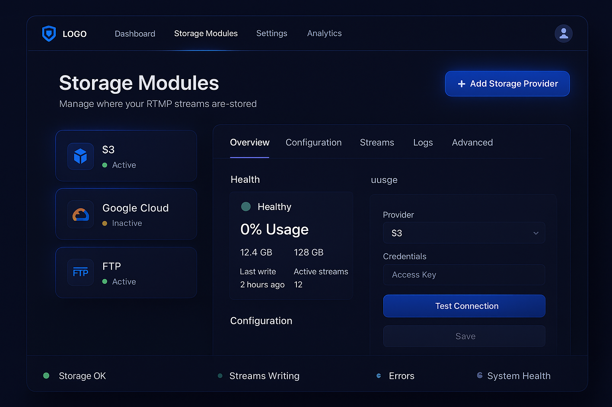

# Project TODO

## Active feature work

- [x] Design and implement RTMP streaming feature to send camera video from memory to a remote RTMP endpoint.
- [x] Analyze current recording and motion-detection implementation (models, recording_service, existing recording UI).
- [x] Design modular storage provider architecture supporting multiple instances per provider (e.g., multiple Google Drives, S3 buckets).
- [x] Implement storage provider models and detailed but simple configuration admin UI for each provider type.
- [x] Extend RecordingManager/recording_service to support multiple storage modules, per-camera destinations, and enable/disable logic.
- [x] Implement recording schedules (per timezone) and show current time in recording settings UI, per user/site timezone.
- [x] Integrate motion detection triggers with recording start/stop policies. (planned)
- [x] Add IP lockout exemption for subnet 192.168.250.0/24 so it bypasses too-many-failed-logins lockout.
- [x] Add Admin Block/Allow menu with IP exemption list, IP/network blocklist, and country-based access policy UI and enforcement.
- [x] Enhance Block/Allow: preload private LAN ranges (10.0.0.0/8, 172.16.0.0/12, etc.) and add a one-click "Exempt this IP" helper on the access-control page.
- [x] Implement Blocklist Publication Service on TCP port 7080 (`/blocklist.csv`) for pfSense/firewalls (strict CSV, read-only, deterministic ordering, short TTL/no-cache, request logging, rate limiting, optional token auth).
- [x] Enforce never-block allowlist exclusions at generation time for blocklist publication (built-in 192.168.250.0/24 and 96.45.17.168-96.45.17.174, plus DB allowlist supersedes subnet blocks).
- [x] Add systemd service integration for blocklist publication service (`pentavision-blocklist.service`) and install/enable it in Ubuntu installer.
- [x] Add Admin pages for Blocklist Distribution settings (UserDB-backed) and Services management (restart allowlisted systemd units with CSRF + audit logging).
- [x] Update the 7080 blocklist service to read distribution settings dynamically from UserDB (env fallback).
- [x] Redesign storage provider system and admin UI into a CSAL-based, pluggable storage orchestration platform (manifest-driven modules, multi-instance, admin module manager).

- [x] Fix video worker startup when recording is enabled: ensure recording service initializes inside a Flask app context.
- [x] Make recording resilient to RTSP/GStreamer failures: fall back to ffmpeg recording when GStreamer preroll fails.
- [x] Use stable per-camera ingest directories (prefer camera MAC address when known; fallback to numeric id).
- [x] Auto-detect camera MAC from IP during camera create/edit/scan; persist to RecordDB.
- [x] Alert on MAC changes (no alert when previous MAC was blank) and run a twice-daily MAC audit in the video worker.

## Pentastar-web UI rules / polish

- [x] Ensure all user feedback (including errors) uses a bottom-right toast bubble with green background and black text.
- [ ] Match Storage Modules UI to `docs\ui-references\storage-modules-manager-reference.png`.

## Storage Modules Manager fixes

- [x] Make existing-module Test on `/storage?edit_module=...` run via AJAX (no page reload) and show toast results.
- [x] Persist Test -> Save proof reliably for both wizard and edit flows.
- [x] On app startup, run a test write for enabled storage modules and record it in `storage_module_write_stats`.
- [ ] Ensure Health/Last write/Last OK/Last error panels reflect `StorageModuleWriteStat` + `StorageModuleHealthCheck` correctly.
- [x] Fix Local Drive Path provider: ensure `base_dir` persists and displays on edit.
- [x] Make Configuration tab "Test Connection" run via AJAX without page refresh/resetting entered values.
- [x] Toast auto-hide: bottom-right messages fade after 10 seconds.
- [x] Polish all storage provider forms (each provider template individually; edit + wizard).

## System setup & security

- [x] Provision Ubuntu 24.04 minimal server (see `deploy/install_ubuntu_24.sh` for automated setup steps).
- [x] Install and configure Apache (modules, TLS/SSL, mod_security, mod_evasive, rewrite).
- [x] Install language runtimes (PHP, Python, Node) and common tools (git, curl, vim).
- [x] Configure UFW firewall (allow only HTTP/HTTPS/SSH) and harden Apache defaults.
- [x] Install and secure MariaDB (run `mysql_secure_installation`).
- [x] Install additional dependencies (ffmpeg, python3, python3-pip, python3-opencv, python3-venv, etc.).
- [x] Set up Fail2ban or similar intrusion-prevention tooling.
- [x] Enable services on boot and ensure regular security updates.

## Graphical web installer

- [x] Design installer flow (multi-step wizard: DB setup, admin account, security options).
- [x] Implement installer endpoint (e.g. `/install/installer.php` or equivalent).
- [x] Add forms for each database (UserDB, FaceDB, RecordDB) with host/port/user/password.
- [x] Add form for initial admin account and core configuration.
- [x] Implement strong server-side validation and CSRF protection.
- [x] Test DB connections and create schemas/tables via parameterized queries.
- [x] Write configuration to secure files (outside webroot, least-privilege permissions).
- [x] Implement installer finalization: lock/remove installer after success, disable directory.
- [x] Protect installer with one-time code or session token and enforce HTTPS during setup.

## Database architecture and segmentation

- [x] Design schemas for user accounts/auth, facial embeddings, and recordings/metadata.
- [x] Decide physical deployment: separate MariaDB servers/instances per component.
- [x] Configure private networking/VLANs and TLS/SSL for DB connections.
- [x] Create separate DB users per service with least-privilege grants.
- [x] Ensure no cross-DB joins in SQL; handle cross-component queries in application layer.
- [x] Set up automated, encrypted backups per database with tested restore procedures.

## Authentication, passkeys, and activity logging

- [x] Choose WebAuthn/FIDO2 server library or service for passkey support.
- [x] Implement passkey registration and login flows (primary auth method) via JSON APIs in the auth blueprint and the auth demo page.
- [x] Implement fallback 2FA (TOTP app, SMS/email OTP, or hardware token).
- [x] Implement secure password handling where needed (Argon2id hashing, salts).
- [x] Implement account lockout and rate limiting for repeated failures.
- [x] Define audit log schema for security events and critical actions.
- [x] Log authentication attempts (success/failure), role changes, configuration changes, and video events.
- [x] Store logs in write-once or tamper-evident storage with restricted access.
- [x] Define log retention and review procedures; integrate with log analysis/alerting tools.

## Facial recognition module

- [x] Select facial recognition stack (e.g. `face_recognition` with dlib/OpenCV or equivalent).
- [x] Implement enrollment flow: capture images during registration, compute embeddings, store in FaceDB (faces demo page + `/api/face/enroll`).
- [x] Design FaceDB schema for embeddings and associated user identifiers.
- [x] Implement runtime processing: detect faces in frames, compute embeddings, compare to stored vectors (snapshot and live camera recognition APIs).
- [x] Choose similarity metric and thresholds and tune for accuracy (Euclidean distance with configurable threshold, default 0.6).
- [x] Overlay recognized user names on live video (dashboard camera tiles, per-camera session view, and faces demo).
- [x] Overlay recognized user names on recorded output during playback (recording playback page with per-frame face recognition overlays).
- [x] Implement privacy controls (opt-out of tagging, deletion of biometric data on request) via FaceDB policy table and opt-out/opt-in APIs.
- [x] Ensure FaceDB is isolated, encrypted at rest, and only accessible to recognition service (handled via deployment/DB configuration and documented operational guidance).

## User interface and flow

- [x] Choose UI stack (server-rendered Flask templates with lightweight vanilla JS and custom CSS).
- [x] Design responsive layout for desktop and mobile (dashboard, navigation, modals) via `main.css` media queries and flexible grids.
- [x] Implement login/auth pages (passkeys, 2FA fallback) with clear UX (auth demo page using WebAuthn and TOTP).
- [x] Implement dashboard with "Start Session" and status indicators (dashboard camera tiles with Start session button and live stream health badges).
- [x] Implement camera access (HTML5 `getUserMedia`) and a "Scan Face" flow for enrollment (faces demo page with webcam capture and enrollment/recognition).
- [x] Implement session page with live video, overlays for recognized users, and controls (per-camera session view with face recognition overlay and simple controls).
- [x] Add pages or views for logs/audit review (admin-only audit events page).
- [x] Add storage settings UI to select and configure storage providers (storage overview page with provider details and configuration hints).
- [x] Implement client-side validation for forms (usernames, passwords, DB settings, etc.).
- [x] Address accessibility (keyboard navigation, ARIA labels, contrast) with aria-live regions, landmarks, and grouped camera tiles.

## Storage provider integration

- [x] Design a storage provider interface/abstraction (`StorageProvider` with `upload`, `get_url`, and `delete`).
- [x] Implement S3-compatible provider module (generic S3 provider supporting AWS S3 and custom endpoints such as Backblaze B2, Wasabi, DigitalOcean Spaces, IBM Cloud OS, etc.).
- [x] Implement cloud vendor object stores (Google Cloud Storage, Azure Blob Storage).
- [x] Implement business file-sync provider example (Dropbox) and a pattern that can be extended to Box, OneDrive for Business, and Google Drive Workspace.
- [x] Implement privacy-focused or self-hosted option via a generic WebDAV provider (e.g. Nextcloud or other WebDAV-compatible services).
- [x] Implement provider configuration UI and credential handling via environment variables (securely scoped to the service process, with secrets masked in the UI).
- [x] Ensure uploads are resilient (upload queue with retries) and store returned IDs/keys in RecordDB, with download support via local files, direct DB reads, or provider URLs/signed URLs.
- [x] Allow admins to choose default provider and per-camera/provider overrides via `STORAGE_TARGETS` and per-camera `CameraStoragePolicy.storage_targets`.

### CSAL pluggable storage modules to implement

- [x] Amazon S3 (AWS) — industry-standard object storage, full REST/S3 API and SDKs.
- [x] Google Cloud Storage (GCS) — JSON & XML REST APIs, client libraries and quickstarts.
- [x] Microsoft Azure Blob Storage — Blob REST API, SAS tokens, and detailed protocol docs.
- [x] Dropbox (Dropbox API v2) — file-level APIs, OAuth flows, SDKs and an API Explorer.
- [x] Microsoft OneDrive / Microsoft Graph (OneDrive API) — file APIs via Microsoft Graph; auth + samples.
- [x] Box — enterprise file storage API, SDKs, and developer guides for integrations.
- [x] Backblaze B2 — native B2 API plus S3-compatible API; clear quickstarts and examples.
- [x] DigitalOcean Spaces — S3-compatible Spaces API with docs and SDK guidance.
- [x] Wasabi — S3-bit-compatible object storage with an S3-style API reference.
- [x] Linode Object Storage — S3-compatible object storage endpoints and API guidance.
- [x] IBM Cloud Object Storage — REST/S3-compatible APIs, IAM integration and SDKs.
- [x] Oracle Cloud Object Storage — OCI Object Storage API and SDK references.
- [x] Rackspace Cloud Files / OpenStack Swift — Swift-compatible object API with developer docs.
- [x] OVHcloud Object Storage — S3/Swift-compatible object storage with getting-started docs.
- [x] Scaleway Object Storage — S3-compatible API, quickstarts and multipart upload guides.
- [x] Cloudflare R2 — S3-compatible object API and R2-specific developer guides (Workers bindings, examples).
- [x] pCloud — REST-style public API for files/folders with method reference and examples.
- [x] MEGA (mega.nz) — developer libraries and APIs (client-side encryption model); community SDKs/docs.
- [x] Nextcloud (self-hosted) — WebDAV + app APIs for file access; full developer WebDAV docs.

## Storage Modules Manager — Full Product & UX Specification

- [ ] Transform `/storage` into a split-view storage orchestration dashboard (providers list left, details panel right).
- [ ] Treat each configured destination as a Storage Module Instance with:
  - provider type
  - credentials & configuration
  - enable/disable
  - connectivity + write test
  - health signals, logs, metrics
  - association to stream writes
- [ ] Provider categories and targets:
  - Object storage (S3-compatible and native)
    - Amazon S3 (AWS)
    - Google Cloud Storage (GCS)
    - Microsoft Azure Blob Storage
    - IBM Cloud Object Storage
    - Oracle Cloud Object Storage
    - Rackspace Cloud Files (OpenStack Swift)
    - OVHcloud Object Storage
    - Scaleway Object Storage
    - Linode Object Storage
    - DigitalOcean Spaces
    - Wasabi
    - Backblaze B2 (native + S3)
    - Cloudflare R2 (S3-compatible)
  - File sync / consumer cloud
    - Dropbox
    - Microsoft OneDrive
    - Box
    - pCloud
    - MEGA
    - Nextcloud
  - Network / protocol-based
    - WebDAV
    - FTP
    - FTPS (explicit/implicit)
    - SFTP
    - SMB/CIFS
    - NFS (advanced)
    - SCP (advanced)
  - Local / on-prem
    - local filesystem paths
    - local drive paths (Windows/Linux server path)
    - mounted volumes (NAS/SAN)
    - container-mounted persistent volumes
- [ ] Providers list (left panel): implement row/cards with:
  - icon/logo
  - user-defined name
  - provider type label
  - status indicator (Healthy / Degraded / Failing / Disabled)
  - active stream count
  - last successful write timestamp
  - overflow actions: Enable/Disable, Edit, Clone, Delete, View Logs
- [ ] Provider details panel (right) with tabs:
  - Overview
  - Configuration
  - Streams
  - Logs
  - Advanced
- [ ] Overview tab (read-only) shows:
  - current health status
  - last connection test result
  - last successful write
  - error rate (last 24h)
  - storage usage (GB/day, GB/month)
  - active vs completed streams
- [ ] Configuration tab:
  - provider selection grouped by category (Object Storage / Cloud Drives / Network Protocols / Local)
  - dynamic credential forms driven by provider schema (required/optional fields, types, validation)
  - enforce Test -> Save flow:
    - validate auth
    - write temporary object/file
    - verify read
    - cleanup test artifact
    - save disabled until test succeeds
    - display success timing details or actionable failure errors
  - add inline help text + "where to find this" links for every provider field (official vendor docs only)
- [ ] Streams tab:
  - stream table with Stream ID, status (writing/completed/failed), file size, duration, last write time, retry count, action (view/inspect)
- [ ] Logs tab:
  - capture auth attempts, upload starts/stops, chunk retries, timeouts, permission errors, cleanup failures
  - UX: severity filtering, search, copy/export, correlation by Stream ID
- [ ] Advanced tab (power users):
  - retention policies
  - directory/object key templates (e.g. `/{provider}/{year}/{month}/{stream_id}.mp4`)
  - chunk size tuning
  - parallel upload limits
  - encryption settings
  - provider-specific flags
  - bandwidth throttling
- [ ] Global system features:
  - storage priority ordering for enabled providers
  - automatic failover on failure (health-based routing)
  - safe disable/delete:
    - warn if active streams exist
    - offer "drain & disable"
    - prevent accidental data loss
  - read-only mode while streams are writing (block credential edits; require stop or provider clone)
- [ ] Add Storage Provider wizard:
  - select provider
  - enter credentials
  - test connection
  - name & tag
  - confirm & enable

- [ ] Modular provider plugin architecture:
  - each provider lives under `app/modules/storage/<provider>/`
  - include a `definition.json` (fields/help/links/capabilities) and `template.html` (form snippet)
  - provider folder can optionally ship `module.py` to register its backend factory
  - registry loads providers so users can add custom modules by dropping in a folder
  - [x] RecordDB tracks installed providers by scanning module folders on startup

### Storage Modules Manager UI layout mockup graphic

- [ ] Create a layout graphic for the Storage Modules Manager page matching the existing dark/electric-blue dashboard theme.
- [ ] Keep an image-generation prompt saved/maintained for regenerating the layout mockup (DALL·E or equivalent).
- [ ] Add UI reference screenshot (elegance/layout benchmark) at `docs/ui-references/storage-modules-manager-reference.png` and keep it linked here.



```
A high-fidelity dark-themed web dashboard UI mockup for a "Storage Modules Manager" page.
Color scheme: deep navy blue background, electric blue gradients, subtle glow accents, rounded cards, modern security camera dashboard aesthetic.

Layout:
- Top navigation bar with logo on the left, menu items centered, user profile on the right.
- Page header reading "Storage Modules" with subtitle "Manage where your RTMP streams are stored".
- Glowing "+ Add Storage Provider" button on the right.

Main content is a split layout:
LEFT PANEL:
- Vertical list of storage provider cards.
- Each card shows a provider icon (S3, Google Cloud, FTP), provider name, status indicator (green, yellow), active stream count.
- Soft blue glow borders and hover effects.

RIGHT PANEL:
- Large detail panel with tabs: Overview, Configuration, Streams, Logs, Advanced.
- Overview tab visible with health status badge, usage metrics placeholders, last write time, and active stream count.
- Configuration section partially visible with provider dropdown, credential fields, "Test Connection" button, disabled "Save" button.

Bottom status bar:
- Displays Storage OK, Streams Writing, Errors, and System Health.

Style:
- Professional, enterprise-grade, modern, clean
- No text clutter
- High contrast white text
- Rounded corners
- Subtle glassmorphism
- Looks like a real SaaS security platform UI
```

## Logging, monitoring, and operations

- [x] Define what to monitor (auth failures, unusual access patterns, storage errors, recognition errors).
- [x] Integrate with log analysis/monitoring stack (e.g. ELK, hosted service) for alerting.
- [x] Configure Fail2ban or similar using log patterns from web/auth services.
- [x] Document operational runbooks for common incidents (DB failure, storage outage, recognition issues).

## Documentation and compliance

- [x] Document installation steps for Ubuntu 24.04 (including web installer usage) (see `docs/ubuntu-setup.md`).
- [x] Document configuration of databases, storage, and security options (see `docs/configuration.md` and `docs/database-architecture.md`).
- [x] Document facial recognition data handling, retention, and deletion procedures (see `docs/facial-recognition.md`).
- [x] Prepare privacy/security notes (GDPR-like considerations for biometrics and logs) (see `docs/privacy-security.md` and `docs/logging-monitoring.md`).

## Advanced security, RBAC, and user profiles

- [ ] Design extended user profile and identity model to capture:
  - Core identity (full legal name, preferred name, optional date of birth).
  - Contact channels (primary/secondary phone and email, emergency contact name/phone, SMS/email alert targets).
  - Addressing/residency (primary residence address, additional properties, residency status per property: Owner/Tenant/Guest/Staff/Remote Viewer).
  - Authentication metadata (MFA preference, login lockout counters, account status, created/modified timestamps, deactivation reason notes).
- [ ] Implement database schema changes for security and access control:
  - Property table (id, address, timezone, descriptive metadata).
  - UserProperty association table (user ↔ property, residency status, authorized zones, camera access scope, time-based access windows, role overrides).
  - Role/Permission mapping tables (Role, Permission, RolePermission, UserRole) to support global and per-property roles.
  - UserNotificationSettings table for per-user alert preferences and escalation tiering.
- [ ] Integrate timezone resolution based on the user's primary residence ZIP code using the `uszipcode` module and persist the resolved timezone on the profile.
- [ ] Design and implement role-based access control (RBAC):
  - Global roles: System Administrator, Property Manager, Technician, Auditor/Read-Only.
  - Site-level roles (per property): Homeowner, Adult Resident, Child Resident, Guest, Housekeeper/Staff, Temporary Contractor, Monitoring Center Viewer.
  - Permission flags for alarms (arm/disarm, silence alarm, bypass/configure zones, view logs, acknowledge alerts, fire panel diagnostics), cameras (live view, playback, export footage, manage cameras, configure retention), and automation (locks, HVAC, lighting, garage/gate, intercom, external integrations).
  - Central helper/decorator for enforcing permissions on Flask routes and APIs.
- [ ] Implement secure login and logout hardening:
  - Enforce failed-attempt lockout counters for both login and disarm PIN, with backoff and unlock policies.
  - Store an 8-digit disarm PIN per user (securely hashed), with PIN history and last-use metadata (panel/app/station).
  - Respect MFA preference (TOTP/email/hardware token/passkeys) and ensure it is enforced where configured.
  - Track account status (Active/Suspended/Disabled) and prevent access appropriately.
- [ ] Implement CSRF and per-page security tokens:
  - Ensure all state-changing endpoints (form posts and JSON APIs) require CSRF tokens.
  - For sensitive pages (e.g., alarm control, camera management, admin actions), generate short-lived per-page tokens bound to user, route, and expiry, and validate them on submit.
- [ ] Build a user-facing profile UI and user menu:
  - Show core profile data, associated properties, roles, and notification preferences.
  - Allow users to edit only permitted fields (e.g., contact info, notification prefs, some MFA options) while keeping role and high-risk settings admin-only.
- [ ] Build an administrator control panel:
  - List/search users, properties, and roles with filtering.
  - Manage user accounts (create, disable/suspend, reset MFA/PIN, set account status and notes).
  - Manage properties (addresses, zones, camera groupings, alarm panels) and user-property associations.
  - Manage roles and permission assignments, both globally and per property.
  - View detailed security and operational audit logs.
- [ ] Implement the property-level association and access layer:
  - Configure authorized zones (perimeter, interior, restricted) per user/property.
  - Configure time-based access windows (e.g., housekeeper Tue/Thu 13:00–16:00) and enforce them in RBAC checks.
  - Define camera access scope (zones, floors, individual cameras) and alarm panel stations each user can interact with.
  - Support per-property role overrides for exceptional cases.
- [ ] Implement notification and escalation settings:
  - Per-user toggles for intrusion, fire, system faults, camera motion, door/window activity, environmental alerts (CO2, temperature, flood).
  - Escalation rules (first-tier vs secondary notifications; suppressed except during access windows).
- [ ] Extend audit logging and behavioral telemetry:
  - Log all security-sensitive actions (login/logout, arm/disarm, silencing, configuration changes, role changes, PIN uses, property and camera access changes).
  - Track last login timestamp, last PIN use, and context (where/how it was used).
- [ ] Seed an initial system administrator account for user "Thalia" and implement safe admin promotion/demotion tools and UI for future administrators.
- [ ] Implement advanced identity enhancements:
  - Link facial recognition templates to user identities in a controlled, privacy-respecting way.
  - Associate hardware tokens and mobile credentials with user accounts.
  - Store geofencing and geolocation metadata where permitted, and support auto-arm/disarm preferences driven by location and schedules.
